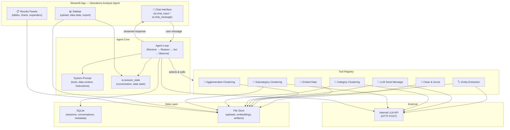
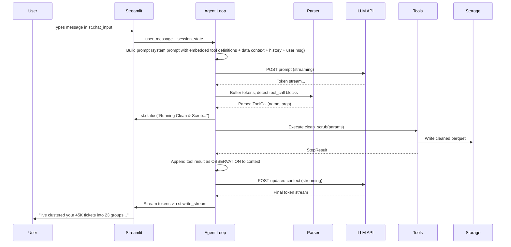
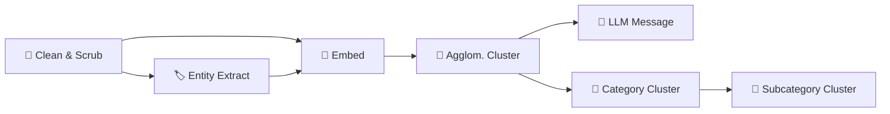
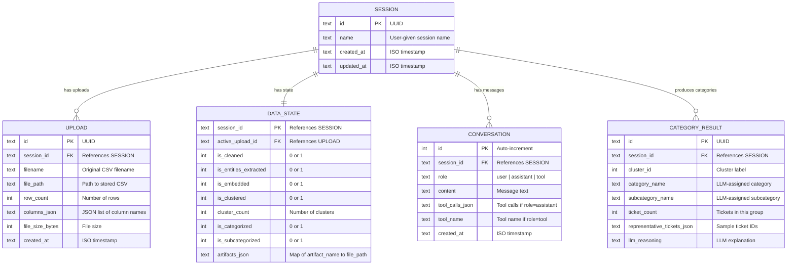
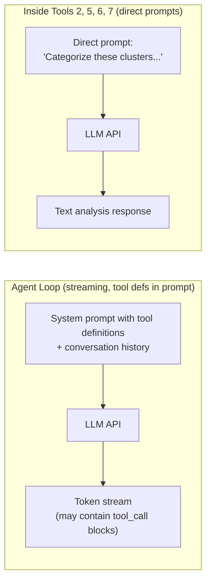
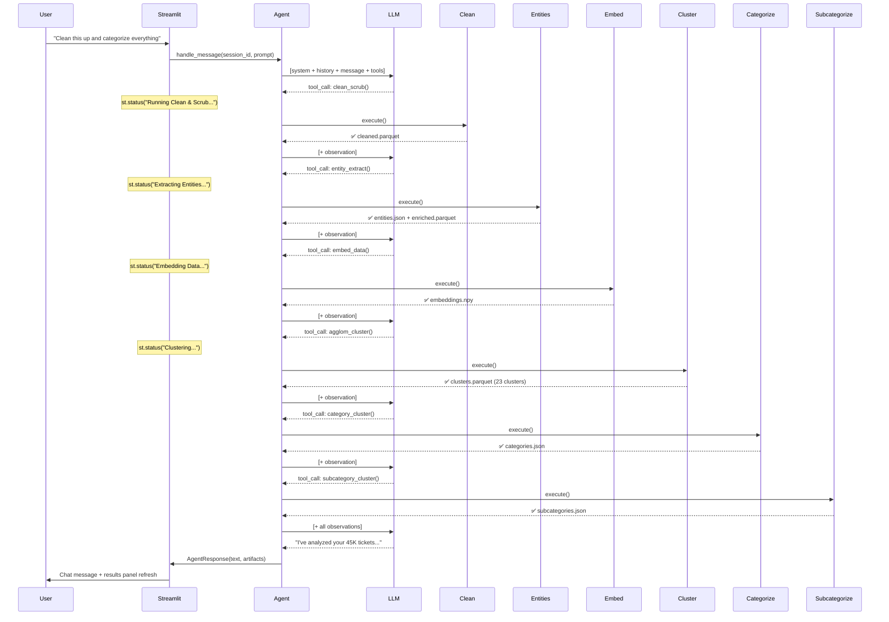
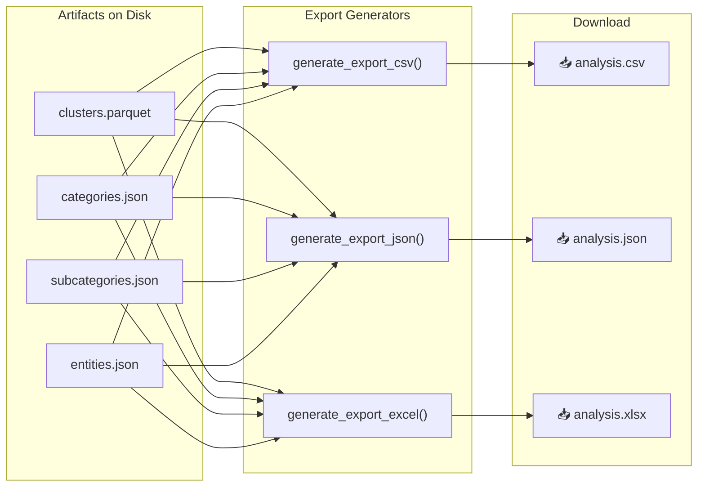

# Operations Analysis Agent — Architecture Design

A Python conversational agent that ingests large operations CSV exports (e.g. ServiceNow request/ticket dumps) and lets the user interactively explore, cluster, and categorize ticket data through natural language chat. The agent decides which analysis tools to invoke based on user requests. The LLM is accessed via HTTP POST to an internal endpoint. UI built with **Streamlit**.

---

## High-Level Architecture



---

## 1. Project Structure

```
ops_agent/
├── app.py                      # Streamlit entry point — Operations Analysis Agent
├── config.py                   # Settings (paths, LLM endpoint, DB path)
├── requirements.txt
│
├── core/
│   ├── __init__.py
│   ├── agent.py                # Agent loop (reason → act → observe)
│   ├── session.py              # Session manager (tracks data state, persists to DB)
│   ├── tool_registry.py        # Tool registration and discovery
│   ├── tool_executor.py        # Executes tool calls, captures results
│   ├── llm_client.py           # HTTP streaming client for internal LLM API
│   ├── parser.py               # Parses tool_call blocks from LLM text output
│   ├── stream_handler.py       # Manages token-by-token streaming to Streamlit
│   └── prompts.py              # System prompt builder (embeds tool definitions)
│
├── tools/
│   ├── __init__.py
│   ├── base.py                 # Abstract BaseTool class
│   ├── clean_scrub.py          # Tool 1: Clean and scrub CSV data
│   ├── entity_extract.py       # Tool 2: Entity extraction via LLM
│   ├── embed_data.py           # Tool 3: Generate embeddings (sentence-transformers)
│   ├── agglom_cluster.py       # Tool 4: Agglomerative clustering
│   ├── llm_message.py          # Tool 5: LLM send message
│   ├── category_cluster.py     # Tool 6: Category clustering with LLM
│   └── subcategory_cluster.py  # Tool 7: Subcategory clustering
│
├── db/
│   ├── __init__.py
│   ├── database.py             # SQLite connection and session management
│   └── models.py               # SQLAlchemy ORM models
│
├── storage/
│   ├── __init__.py
│   └── file_store.py           # Manages file artifacts on disk
│
└── data/                       # Runtime data directory (gitignored)
    ├── ops_agent.db
    ├── uploads/
    └── artifacts/
        └── {session_id}/
            ├── cleaned.parquet
            ├── entities.json
            ├── enriched.parquet
            ├── embeddings.npy
            ├── clusters.parquet
            ├── categories.json
            ├── subcategories.json
            └── exports/            # Generated export files
                ├── report.csv
                ├── report.json
                └── report.xlsx
```

> [!TIP]
> **Compared to the FastAPI version**: The entire `web/` directory (routes, templates, static files, JS, CSS) is gone. The UI is fully defined in `app.py` using Streamlit's Python API. No HTML, no JavaScript, no WebSocket wiring.

---

## 2. Agent Core Design

### 2.1 The Agent Loop

The agent follows a **ReAct pattern** (Reason → Act → Observe). Tool definitions are **embedded in the system prompt** as structured text. The LLM responds with fenced `tool_call` blocks that the agent parses from the streamed text.



### 2.2 Text-Based Tool Calling Protocol

Since the internal LLM does not support native function calling, tool definitions are embedded in the system prompt and the LLM uses a fenced block convention to invoke tools:

**System prompt includes tool definitions like:**

```
## Available Tools

You have access to the following tools. To call a tool, respond with a
fenced tool_call block. You may call ONE tool per response. After the
tool executes, you will receive an OBSERVATION with the result, then
you can decide whether to call another tool or respond to the user.

### clean_scrub
Description: Clean and scrub the uploaded CSV data. Removes duplicates,
  standardizes formats, handles missing values.
Parameters:
  - drop_duplicates (bool, optional): Remove duplicate rows. Default: true
  - fill_strategy (string, optional): How to fill missing values. Options: "drop", "mean", "mode", "empty". Default: "drop"
Requires: An uploaded CSV file

### entity_extract
Description: Extract named entities (systems, applications, groups, locations,
  error codes) from ticket text fields using the LLM.
Parameters:
  - fields (list[string], optional): Which text columns to extract from.
    Default: all text columns
Requires: clean_scrub

### embed_data
Description: Generate vector embeddings for the ticket text using
  sentence-transformers (runs locally, no LLM API call).
Parameters:
  - model (string, optional): Embedding model name. Default: "all-MiniLM-L6-v2"
  - batch_size (int, optional): Batch size for encoding. Default: 256
Requires: clean_scrub

### agglom_cluster
Description: Perform agglomerative clustering on the embeddings.
Parameters:
  - n_clusters (int, optional): Number of clusters. Default: auto-detect
  - linkage (string, optional): Linkage method. Options: "ward", "complete", "average". Default: "ward"
Requires: embed_data

### llm_message
Description: Send a freeform prompt to the LLM for analysis, summarization,
  or Q&A about the current data. General-purpose tool.
Parameters:
  - prompt (string, required): The question or instruction to send
  - context_data (string, optional): Additional data to include
Requires: none (but data context is more useful after processing)

### category_cluster
Description: Use the LLM to assign meaningful category names to each
  agglomerative cluster based on representative tickets.
Parameters:
  - sample_size (int, optional): Tickets per cluster to sample. Default: 10
Requires: agglom_cluster

### subcategory_cluster
Description: Break each category into finer subcategories using the LLM.
Parameters:
  - max_subcategories (int, optional): Max subcategories per category. Default: 5
Requires: category_cluster
```

**LLM calls a tool by responding with:**

````
I'll start by cleaning and deduplicating your data.

```tool_call
{"tool": "clean_scrub", "args": {"drop_duplicates": true, "fill_strategy": "drop"}}
```
````

**Agent appends the observation and sends it back:**

```
OBSERVATION (clean_scrub):
Success. Cleaned 45,231 → 44,028 rows (1,203 duplicates removed).
Standardized 3 date columns. Dropped 47 rows with missing required fields.
Artifact: cleaned.parquet (44,028 rows × 28 columns)
```

### 2.3 Tool Call Parser (`core/parser.py`)

```python
class ToolCallParser:
    """Extracts tool_call blocks from LLM text output."""

    PATTERN = r"```tool_call\s*\n(\{.*?\})\s*\n```"

    def parse(self, text: str) -> ParseResult:
        """
        Returns:
            ParseResult with:
              - has_tool_call: bool
              - tool_name: str | None
              - tool_args: dict | None
              - surrounding_text: str  (text before/after the block)
        """

    def parse_streaming(self, token_buffer: str) -> tuple[bool, str]:
        """
        Called incrementally as tokens arrive.
        Returns (is_complete, remaining_text).
        Detects when a tool_call block opens (```) and buffers
        until the closing (```), then parses.
        """
```

### 2.4 Agent Loop with Streaming

```python
class Agent:
    def __init__(self, llm_client, tool_registry, session_manager, parser):
        self.llm = llm_client
        self.tools = tool_registry
        self.sessions = session_manager
        self.parser = parser

    def handle_message(self, session_id: str, user_message: str,
                       status_callback=None,
                       stream_callback=None) -> AgentResponse:
        """
        Process a user message through the agent loop.

        Args:
            status_callback: Called with status text (for st.status updates)
            stream_callback: Called with each token for final response streaming
        """
        session = self.sessions.get(session_id)

        # Build prompt with tool definitions embedded in system prompt
        system_prompt = build_system_prompt(
            session=session,
            tools=self.tools.get_all()    # Embeds tool schemas in prompt text
        )
        messages = [
            {"role": "system", "content": system_prompt},
            *session.conversation_history,
            {"role": "user", "content": user_message},
        ]

        max_iterations = 10
        for iteration in range(max_iterations):
            # Stream response from LLM, collecting full text
            full_response = ""
            is_final_response = (iteration > 0)  # Stream to UI only on final turn

            for token in self.llm.stream(messages):
                full_response += token
                if is_final_response and stream_callback:
                    # Only stream to UI if no tool_call detected yet
                    if "```tool_call" not in full_response:
                        stream_callback(token)

            # Check if response contains a tool call
            parse_result = self.parser.parse(full_response)

            if parse_result.has_tool_call:
                tool = self.tools.get(parse_result.tool_name)

                if status_callback:
                    status_callback(f"Running {tool.name}...")

                result = tool.execute(session, parse_result.tool_args)

                # Append assistant response + observation
                messages.append({"role": "assistant", "content": full_response})
                messages.append({"role": "user", "content":
                    f"OBSERVATION ({tool.name}):\n{result.summary}"})

                session.update_artifacts(tool.name, result)
            else:
                # No tool call — this is the final response to the user
                session.add_to_history("user", user_message)
                session.add_to_history("assistant", full_response)
                return AgentResponse(
                    text=full_response,
                    artifacts=session.latest_artifacts
                )

        raise MaxIterationsError("Agent exceeded max tool-call iterations")
```

> [!TIP]
> **Two-phase streaming**: During tool-calling iterations, the agent buffers the full response to detect `tool_call` blocks. On the final iteration (no tool call), tokens stream directly to `st.write_stream` for real-time display in the chat.

### 2.5 Session & Data State

```python
@dataclass
class Session:
    id: str
    created_at: datetime

    uploads: list[UploadInfo]
    active_upload_id: str | None
    data_state: DataState
    conversation_history: list[dict]
    artifacts: dict[str, Path]

@dataclass
class DataState:
    """Tracks what processing has been completed on the active dataset."""
    is_cleaned: bool = False
    is_entities_extracted: bool = False
    is_embedded: bool = False
    is_clustered: bool = False
    cluster_count: int | None = None
    is_categorized: bool = False
    is_subcategorized: bool = False
    row_count: int | None = None
    column_names: list[str] = field(default_factory=list)
```

> [!IMPORTANT]
> **Streamlit session_state vs. DB persistence**: `st.session_state` holds the live session for the current browser tab. On meaningful changes (upload, tool completion, new message), the session is persisted to SQLite so it survives restarts and can be resumed later.

---

## 3. Streamlit UI Design

### 3.1 App Layout (`app.py`)

```python
# app.py — Conceptual structure
import streamlit as st

st.set_page_config(page_title="Operations Analysis Agent", layout="wide")

# ── Sidebar: Upload, Data Context, Export ──
with st.sidebar:
    st.title("⚙️ Operations Analysis Agent")

    # File upload
    uploaded_file = st.file_uploader("Upload CSV", type=["csv"])

    # Data state indicators
    if session has data:
        st.subheader("📊 Data Context")
        st.metric("Rows", "45,231")
        st.metric("Columns", "28")
        show_pipeline_status()     # ✅/⬜ indicators

    # Session management
    st.selectbox("Session", sessions)

    # Export buttons
    st.download_button("📥 Export Categories CSV", ...)
    st.download_button("📥 Export Full Report JSON", ...)

# ── Main Area: Chat + Results ──
chat_col, results_col = st.columns([3, 2])

with chat_col:
    # Render conversation history
    for msg in st.session_state.conversation_history:
        with st.chat_message(msg["role"]):
            st.markdown(msg["content"])

    # Chat input
    if prompt := st.chat_input("Ask me to analyze your tickets..."):
        with st.chat_message("user"):
            st.markdown(prompt)

        with st.chat_message("assistant"):
            with st.status("Thinking...", expanded=True) as status:
                # Stream final response token-by-token
                response_container = st.empty()
                streamed_text = []

                def on_token(token):
                    streamed_text.append(token)
                    response_container.markdown("".join(streamed_text))

                response = agent.handle_message(
                    session_id, prompt,
                    status_callback=lambda msg: status.update(label=msg),
                    stream_callback=on_token
                )

            # Final render with complete text
            response_container.markdown(response.text)

with results_col:
    # Show results panels based on what's available
    if has_categories:
        render_category_tree()
    if has_clusters:
        render_cluster_chart()
    if has_entities:
        render_entity_summary()
```

### 3.2 UI Wireframe

```
┌──────────────────────────────────────────────────────────────────┐
│  ⚙️ Operations Analysis Agent                                    │
├──────────┬────────────────────────────────┬──────────────────────┤
│ SIDEBAR  │  CHAT                          │  RESULTS             │
│          │                                │                      │
│ [Upload] │  🤖 Welcome! Upload a CSV to   │  ┌────────────────┐  │
│ [CSV ▾]  │     get started.               │  │ 📊 Categories  │  │
│          │                                │  │                │  │
│ ┌──────┐ │  👤 Here's our Q2 requests     │  │ ▸ Network (12K)│  │
│ │ 📄   │ │     [requests_q2.csv ✓]        │  │ ▸ Access (8K)  │  │
│ │45,231│ │                                │  │ ▸ Hardware(6K) │  │
│ │ rows │ │  🤖 Loaded! 45,231 tickets,    │  │ ▸ Software(5K) │  │
│ │28 col│ │     28 columns. What would     │  │ ▸ Other (3K)   │  │
│ └──────┘ │     you like to do?            │  └────────────────┘  │
│          │                                │                      │
│ Pipeline │  👤 Clean it up, extract       │  ┌────────────────┐  │
│ ✅ Clean │     entities, and categorize    │  │ 📈 Cluster     │  │
│ ✅ Entity│     everything                 │  │    Distribution │  │
│ ✅ Embed │                                │  │                │  │
│ ✅ Clust │  🤖 On it! Let me run the      │  │  [Plotly chart] │  │
│ ✅ Categ │     full analysis pipeline...   │  │                │  │
│ ✅ Subcat│                                │  └────────────────┘  │
│          │     ┌─ Running ──────────────┐ │                      │
│ ──────── │     │ ✅ Clean & Scrub       │ │  ┌────────────────┐  │
│ Sessions │     │ ✅ Entity Extraction   │ │  │ 🏷️ Top Entities│  │
│ [Q2 ▾]   │     │ ✅ Embed Data         │ │  │                │  │
│ [+ New]  │     │ ✅ Clustering (23 grp) │ │  │ VPN: 4,231     │  │
│          │     │ ✅ Categorization      │ │  │ SAP: 3,102     │  │
│ ──────── │     │ ✅ Subcategorization   │ │  │ Okta: 2,877    │  │
│ Export   │     └────────────────────────┘ │  └────────────────┘  │
│ [📥 CSV] │                                │                      │
│ [📥 JSON]│     Found 23 clusters across   │                      │
│          │     8 categories. Top issues:   │                      │
│          │     1. VPN connectivity (27%)   │                      │
│          │     2. Password resets (18%)    │                      │
│          │     ...                         │                      │
│          │                                │                      │
│          │  ┌──────────────────────────┐  │                      │
│          │  │ Ask me anything...    [➤]│  │                      │
│          │  └──────────────────────────┘  │                      │
└──────────┴────────────────────────────────┴──────────────────────┘
```

### 3.3 Key Streamlit Components Used

| Component | Purpose |
|-----------|---------|
| `st.chat_input` / `st.chat_message` | Conversational interface |
| `st.sidebar` | Upload zone, data state, session picker, export |
| `st.file_uploader` | CSV drag-and-drop upload |
| `st.status` | Live progress during tool execution |
| `st.columns` | Side-by-side chat + results layout |
| `st.expander` | Collapsible category/subcategory tree |
| `st.dataframe` | Interactive data tables for drill-down |
| `st.plotly_chart` | Cluster distribution, category pie charts |
| `st.metric` | Row count, cluster count, etc. |
| `st.download_button` | Export CSV/JSON results |
| `st.selectbox` | Session picker |
| `st.session_state` | In-memory state across reruns |

### 3.4 Interaction Patterns

| User Action | What Happens |
|-------------|-------------|
| Upload CSV via sidebar | File saved, preview shown, agent notified |
| Type "clean and categorize everything" | Agent runs tools 1→2→3→4→6→7, st.status shows progress |
| Type "just show me entities" | Agent runs tools 1→2 only |
| Type "re-cluster with 15 groups" | Agent re-runs tool 4 with `n_clusters=15`, invalidates downstream |
| Type "what's in cluster 5?" | Agent uses tool 5 to summarize, response streamed to chat |
| Type "export the categories" | `st.download_button` appears in sidebar/results |
| Upload a new CSV | Agent asks: replace current data or new session? |
| Switch session in sidebar | Conversation history + data state restored from DB |

### 3.5 Streamlit Session State Management

```python
# Initialization (runs once per browser tab)
if "initialized" not in st.session_state:
    st.session_state.initialized = True
    st.session_state.session_id = create_or_restore_session()
    st.session_state.conversation_history = []
    st.session_state.data_state = DataState()
    st.session_state.artifacts = {}
    st.session_state.agent = Agent(llm_client, tool_registry, session_manager)
```

> [!IMPORTANT]
> **Streamlit rerun behavior**: Streamlit reruns the entire `app.py` script on every interaction. All mutable state lives in `st.session_state`. Heavy objects (DataFrames, embeddings) are referenced by file path in session_state, not held in memory — they're loaded on demand via `@st.cache_data` or `@st.cache_resource`.

---

## 4. Tool Design

### 4.1 Tool Interface

```python
class BaseTool:
    name: str                    # e.g. "clean_scrub"
    description: str             # Shown to the LLM in system prompt
    parameters: dict             # JSON Schema for tool arguments
    requires: list[str]          # Prerequisites, e.g. ["clean_scrub"]

    def validate(self, session: Session) -> tuple[bool, str]
    def execute(self, session: Session, args: dict) -> StepResult
```

### 4.2 Tool Dependency Graph



| Tool | Depends On | Can Be Called Independently |
|------|-----------|---------------------------|
| 1. Clean & Scrub | Upload exists | ✅ Yes |
| 2. Entity Extract | Clean & Scrub | ✅ Yes — "extract entities from my data" |
| 3. Embed Data *(sentence-transformers, local)* | Clean & Scrub (+ optionally Entity Extract) | ✅ Yes — "embed the data" |
| 4. Agglom. Cluster | Embed Data | ✅ Yes — "cluster with 30 groups" |
| 5. LLM Message | Any (general purpose) | ✅ Yes — "summarize cluster 5" |
| 6. Category Cluster | Agglom. Cluster | ✅ Yes — "categorize the clusters" |
| 7. Subcategory Cluster | Category Cluster | ✅ Yes — "break down the Network category" |

### 4.3 Tool Result Contract

```python
@dataclass
class StepResult:
    tool_name: str
    success: bool
    summary: str                 # Human-readable for the LLM to relay to user
    artifacts: dict[str, Path]   # Files produced
    data_state_updates: dict     # e.g. {"is_clustered": True, "cluster_count": 23}
    error: str | None = None
```

---

## 5. Data Storage Design

### 5.1 SQLite Schema



### 5.2 File Store Layout

```
data/
├── ops_agent.db
├── uploads/
│   ├── {upload_id_1}.csv
│   └── {upload_id_2}.csv
└── artifacts/
    └── {session_id}/
        ├── cleaned.parquet
        ├── entities.json
        ├── enriched.parquet
        ├── embeddings.npy
        ├── clusters.parquet
        ├── categories.json
        ├── subcategories.json
        └── exports/
            ├── report.csv
            ├── report.json
            └── report.xlsx
```

> [!TIP]
> When the user re-runs a tool (e.g. "re-cluster with 15 groups"), the old artifact is overwritten and `DataState` is updated. Downstream artifacts are invalidated — the agent knows it needs to re-categorize.

---

## 6. LLM Client Design

### 6.1 Dual Use

The LLM client is used in two distinct ways:



1. **Agent loop**: System prompt embeds tool definitions → LLM streams text → parser detects `tool_call` blocks
2. **Inside tools** (2, 5, 6, 7): Direct prompts for analysis → plain text response (no tool calling)

### 6.2 Client Interface — Streaming

```python
class LLMClient:
    def __init__(self, base_url: str, headers: dict, timeout: int = 120):
        self.base_url = base_url
        self.headers = headers
        self.timeout = timeout
        self.client = httpx.Client(timeout=timeout)

    def stream(self, messages: list[dict]) -> Generator[str, None, None]:
        """
        POST to internal LLM endpoint with streaming enabled.
        Yields tokens one at a time as they arrive.
        """
        payload = {"messages": messages, "stream": True}
        with self.client.stream("POST", self.base_url,
                                json=payload, headers=self.headers) as resp:
            for chunk in resp.iter_text():
                # Parse SSE or chunked format from your internal API
                token = self._parse_chunk(chunk)
                if token:
                    yield token

    def send(self, messages: list[dict]) -> str:
        """
        Non-streaming send. Used by tools for direct LLM calls.
        Returns complete response text.
        """
        payload = {"messages": messages, "stream": False}
        resp = self.client.post(self.base_url, json=payload,
                                headers=self.headers)
        return self._parse_response(resp.json())
```

> [!TIP]
> **Tool 3 (Embed Data) does NOT use the LLM client.** It runs `sentence-transformers` locally — no network call to the LLM API. This keeps embedding fast and independent of LLM availability.

---

## 7. Configuration

```python
@dataclass
class Settings:
    # Paths
    data_dir: Path = Path("data")
    db_path: Path = Path("data/ops_agent.db")

    # LLM — Internal API
    llm_base_url: str = "http://internal-llm-host/v1/chat"
    llm_headers: dict = field(default_factory=lambda: {
        "Authorization": "Bearer ...",
        "Content-Type": "application/json"
    })
    llm_model: str = "default"
    llm_timeout: int = 120
    llm_max_iterations: int = 10

    # Embedding (local, sentence-transformers)
    embedding_model: str = "all-MiniLM-L6-v2"
    embedding_batch_size: int = 256

    # Clustering defaults
    default_max_clusters: int = 50

    # Streamlit
    page_title: str = "Operations Analysis Agent"
    page_icon: str = "⚙️"
```

Loaded from a `.env` file via `python-dotenv`.

---

## 8. Key Dependencies

```
streamlit               # UI framework
sqlalchemy              # ORM / database
pandas                  # Data manipulation
numpy                   # Numerical arrays
pyarrow                 # Parquet support
scikit-learn            # Agglomerative clustering
sentence-transformers   # Local embeddings (Tool 3)
httpx                   # HTTP streaming client for LLM API
plotly                  # Interactive charts in Streamlit
openpyxl                # Excel export
python-dotenv           # Config
```

---

## 9. Data Flow — Full Analysis Example

When the user says *"Clean this up and categorize everything"*:



---

## 10. Export & Viewing Design

### 10.1 In-App Viewing (Results Panel)

The right column of the Streamlit UI renders results panels conditionally based on `DataState` — only showing panels for completed stages:

```python
# Results column rendering logic
with results_col:
    ds = st.session_state.data_state

    # ── Category & Subcategory Tree ──
    if ds.is_categorized:
        st.subheader("📊 Categories")
        categories = load_json(artifacts["categories"])
        for cat in categories:
            with st.expander(f"{cat['name']} ({cat['ticket_count']:,} tickets)"):
                if ds.is_subcategorized:
                    subcats = get_subcategories_for(cat['name'])
                    for sub in subcats:
                        st.markdown(f"  • **{sub['name']}** — {sub['ticket_count']:,} tickets")
                st.caption(f"LLM reasoning: {cat['llm_reasoning']}")

                # Drill-down: show sample tickets
                if st.button(f"Show tickets", key=f"drill_{cat['name']}"):
                    tickets_df = load_cluster_tickets(cat['cluster_id'])
                    st.dataframe(tickets_df, use_container_width=True)

    # ── Cluster Distribution Chart ──
    if ds.is_clustered:
        st.subheader("📈 Cluster Distribution")
        clusters_df = pd.read_parquet(artifacts["clusters"])
        fig = px.pie(clusters_df.groupby("cluster_label").size().reset_index(
            name="count"), values="count", names="cluster_label",
            title="Tickets per Cluster")
        st.plotly_chart(fig, use_container_width=True)

        # Bar chart: category sizes
        if ds.is_categorized:
            cat_df = pd.DataFrame(categories)
            fig_bar = px.bar(cat_df.sort_values("ticket_count", ascending=True),
                x="ticket_count", y="name", orientation="h",
                title="Category Sizes")
            st.plotly_chart(fig_bar, use_container_width=True)

    # ── Entity Summary ──
    if ds.is_entities_extracted:
        st.subheader("🏷️ Top Entities")
        entities = load_json(artifacts["entities"])
        entity_counts = count_entities(entities)  # e.g. {"VPN": 4231, "SAP": 3102}
        for name, count in list(entity_counts.items())[:10]:
            st.metric(name, f"{count:,}")

    # ── Raw Data Preview ──
    if ds.is_cleaned:
        with st.expander("🔍 Data Preview"):
            df = pd.read_parquet(artifacts["cleaned"])
            st.dataframe(df.head(100), use_container_width=True)
```

### 10.2 Export Formats

Three export formats available via sidebar download buttons and chat commands:

| Format | What's Included | Best For |
|--------|----------------|----------|
| **CSV** | Flat table: ticket ID, original fields, cluster label, category, subcategory, extracted entities | Importing into Excel, other tools, databases |
| **JSON** | Hierarchical report: categories → subcategories → cluster stats → sample tickets + entity summary + metadata | Programmatic consumption, archival |
| **Excel** | Multi-sheet workbook (see below) | Management reports, sharing with non-technical stakeholders |

**Excel workbook structure:**

| Sheet | Contents |
|-------|----------|
| **Summary** | Run metadata, total tickets, cluster count, top categories, top entities |
| **Categories** | Category name, subcategories, ticket count, %, LLM reasoning |
| **Subcategories** | Parent category, subcategory name, ticket count, representative ticket summaries |
| **Entities** | Entity name, type (system/group/location/error), frequency, associated categories |
| **All Tickets** | Full cleaned data with cluster labels, category, subcategory columns appended |

### 10.3 Export Triggers

Exports can be triggered three ways:

```python
# 1. Sidebar download buttons (always visible when data is available)
with st.sidebar:
    if ds.is_categorized:
        st.divider()
        st.subheader("📥 Export")

        csv_data = generate_export_csv(session)
        st.download_button("Download CSV", csv_data,
            file_name=f"analysis_{session.name}.csv", mime="text/csv")

        json_data = generate_export_json(session)
        st.download_button("Download JSON", json_data,
            file_name=f"analysis_{session.name}.json", mime="application/json")

        excel_data = generate_export_excel(session)
        st.download_button("Download Excel", excel_data,
            file_name=f"analysis_{session.name}.xlsx",
            mime="application/vnd.openxmlformats-officedocument.spreadsheetml.sheet")

# 2. Chat command — user says "export as CSV" or "download the results"
#    Agent generates the file and surfaces a download button in the chat.

# 3. Auto-generated after full analysis completes
#    The agent proactively offers export links in its final summary message.
```

### 10.4 Export Data Flow



### 10.5 Partial Exports

Not all stages need to complete before exporting. The export adapts to what's available:

| DataState | What Can Be Exported |
|-----------|---------------------|
| Cleaned only | Cleaned data CSV |
| Entities extracted | Cleaned data + entity columns |
| Clustered | Cleaned data + cluster labels |
| Categorized | Full report with categories |
| Subcategorized | Full report with categories + subcategories |

---

## Proposed Build Order

| Phase | What | Key Files |
|-------|------|-----------|
| **Phase 1** | Project skeleton, config, DB schema, file store | `config.py`, `db/`, `storage/` |
| **Phase 2** | Agent core — loop, parser, streaming, session, LLM client, tool registry | `core/` |
| **Phase 3** | Tool stubs (base class + 7 stubs with mock results) | `tools/` |
| **Phase 4** | Streamlit UI — chat, sidebar, results panels | `app.py` |
| **Phase 5** | Export system — CSV, JSON, Excel generators | `storage/`, `app.py` |
| **Phase 6** | Wire in real tool implementations (you provide) | `tools/*.py` |
| **Phase 7** | Polish — charts, error handling, caching | All |

---

## Verification Plan

### Automated Tests
- `pytest` for agent loop (mock LLM, verify tool call parsing from text)
- `pytest` for ToolCallParser (valid blocks, malformed blocks, no blocks, multiple blocks)
- `pytest` for session/data state management and DB persistence
- `pytest` for tool dependency resolution and prerequisite detection
- `pytest` for export generators (CSV/JSON/Excel output validation)

### Manual Verification
- `streamlit run app.py` — upload CSV, chat with agent using stub tools
- Verify token-by-token streaming in the chat panel
- Verify st.status shows tool progress during analysis
- Test re-run scenarios ("re-cluster with fewer groups")
- Test session persistence — close browser, reopen, verify conversation restores
- Test prerequisite auto-detection ("categorize" when data isn't clustered yet)
- Test all three export formats — open CSV in Excel, validate JSON schema, verify Excel sheets
